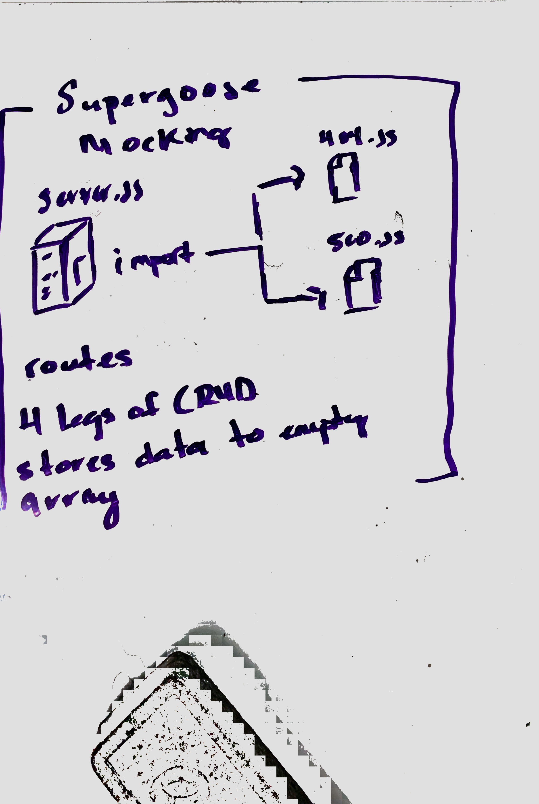

# LAB - 07

## API Sever

### Author: Jeremy

### Links and Resources
* [submission PR](http://xyz.com)
* [travis](http://xyz.com)

### Modules
#### `modulename.js`
`500.js`
`404.js`
##### Exported Values and Methods
`500 error response`
`404 page not found response`

### Setup
#### `.env` requirements
* `8080` - Port Number

#### Running the app
* `nodemon`
* Endpoint: ` GET /categories`
  * Returns a JSON object with all available records in DB
* Endpoint: `GET /categories/:id`
  * Returns a JSON object with a single record from the DB
* Endpoint: `POST /categories`
  * Creates a JSON object to make record in the database
* Endpoint: `DELETE /categories/:id`
  * Deletes a record in the data base
*Endpoint: `PUT /categories/:id`
  * Updates a record in the database

#### Tests
* How do you run tests?
`npm test`
* What assertions were made? 🤔

#### UML

